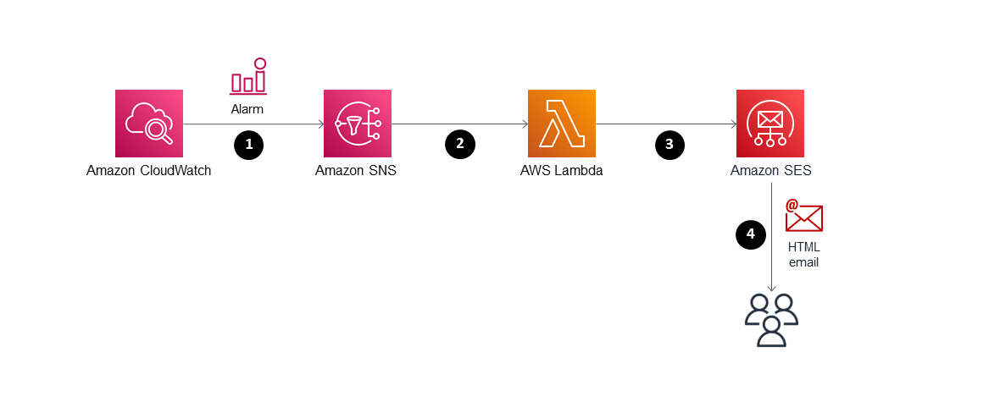
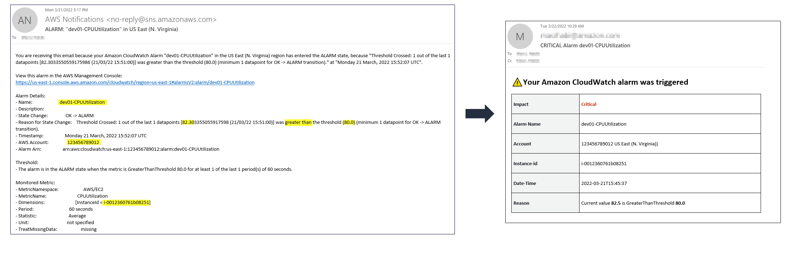

# CloudWatchAlarmFormattedEmail - Formatting CloudWatch alarms email notifications using SES

This solution enables you to customize CloudWatch alarm email alerts using Amazon Simple Email Service (Amazon SES) and AWS Lambda. You will be able to extract the relevant bits of information that you need from the alarm message and display them in an easy-to-read HTML format.

&nbsp;

# Architecture



The diagram shows the following workflow:

1. Amazon CloudWatch alarm state changes and sends notification alert to the associated SNS topic.
2. Amazon SNS will invoke the subscribed Lambda function.
3. Lambda function will parse the alarm message and call the Amazon SES API.
4. Amazon SES will apply the HTML formatting based on a specified template and send the formatted email.

&nbsp;

# Requirements

1. AWS account & IAM User or Role 
2. [AWS CLI v2](https://docs.aws.amazon.com/cli/latest/userguide/getting-started-install.html) installed.
   
3. A verified [Amazon SES identity](https://docs.aws.amazon.com/ses/latest/dg/verify-addresses-and-domains.html) which will be used as the sender email.

&nbsp;
# Deployment
1. Clone the **amazon-cloudwatch-alarm-formatted-email** github repository to your computer using the following command:
    ```
    git clone https://github.com/aws-samples/amazon-cloudwatch-alarm-formatted-email
    ```

2. Configure the [AWS credential keys](https://docs.aws.amazon.com/cli/latest/userguide/cli-configure-quickstart.html) to authenticate and authorize the AWS CLI commands on your account.

3. Verify an email identity in Amazon SES. This is the email address that you will use as sender:
    ```
    aws ses verify-email-identity --email-address <Your email address>
    ```
    After issuing this command, you should recive an email for the verification request. You will need to click on the URL link to confirm that you are authorized to use this email address.

4. [Create an S3 bucket](https://docs.aws.amazon.com/AmazonS3/latest/userguide/create-bucket-overview.html) that will be used to store and access the CWAlarmFormattedEmail Lambda function deployment package if you don't already have one.

5. Create a zip file containing the CWAlarmFormattedEmail Lambda function code located in the [src](./src/) directory. This is the deployment package of the AWS Lambda function.
   
   For MAC: 
    ```
    zip -j amazon-cloudwatch-alarm-formatted-email.zip src/*
    ```

    For Windows (Powershell):
    ```
    Compress-Archive ./src/* amazon-cloudwatch-alarm-formatted-email.zip
    ```


6. Copy the **amazon-cloudwatch-alarm-formatted-email.zip** file to your S3 bucket:
    ```
    aws s3 cp amazon-cloudwatch-alarm-formatted-email.zip s3://<bucket name>
    ```

7. Deploy the CloudFormation stack that will create the:
     -  AWS Lambda function along with its IAM execution role
     -  Amazon SES HTML template email
     -  Amazon SNS topic along with its topic policy
     
     &nbsp;

    ```
    aws cloudformation create-stack --stack-name amazon-cloudwatch-alarm-formatted-email \
    --template-body file://cloudformation/cwalarm-formatted-email.cfn.json \
    --capabilities CAPABILITY_IAM CAPABILITY_AUTO_EXPAND \
    --parameters ParameterKey=pS3DeploymentBucket,ParameterValue=<S3 bucket that contains Lambda zip package> \
	ParameterKey=pS3DeploymentKey,ParameterValue=<S3 key of the Lambda deployment package (.zip)> \
    ParameterKey=pEmailSource,ParameterValue=<Sender email address. Should be a verified identity in SES> \
    ParameterKey=pEmailToAddress,ParameterValue=<Receiver (To:) email address> \
    ParameterKey=pEmailCcAddress,ParameterValue=<Receiver (Cc:) email address> \
    ParameterKey=pEmailReplyToAddress,ParameterValue=<Reply To email address> \
    --region <enter your aws region id, e.g. "us-east-1">
    ```
# Usage
After the deployment, you should be able to test out the soltuion by [creating a CloudWatch Alarm](https://docs.aws.amazon.com/AmazonCloudWatch/latest/monitoring/ConsoleAlarms.html) and associating it to the SNS topic deployed by the CloudFormation stack.

Once the alarm is triggered, you should receive an HTML formatted email notification to the address specified in the ```pEmailToAddress``` CloudFormation paramter.

**Note**:  Although most of the time each message will be delivered to your application exactly once, the distributed nature of Amazon SNS and transient network conditions could result in occasional, duplicate messages at the subscriber end.


&nbsp;

# Sample Output


&nbsp;

# Customization

To change how the email looks, you need to update the HTML code in the ```HtmlPart``` property found in the Cloudformation stack [cwalarm-formatted-email.cfn.json](./cloudformation/cwalarm-formatted-email.cfn.json)

The CWAlarmFormattedEmail Lambda function extracts some common values from the alarm event message (account-id, region etc.) and an EC2 specific value (instance-id).
To use the solution with non-EC2 metrics, make sure to update the Lambda function code.

&nbsp;

# Security

Amazon SNS provides in-transit encryption by default. It is recommended   to also enable server side encryption using AWS KMS [Customer managed CMK](https://docs.aws.amazon.com/kms/latest/developerguide/concepts.html). 


See [CONTRIBUTING](CONTRIBUTING.md#security-issue-notifications) for more information.

&nbsp;

# License

This library is licensed under the MIT-0 License. See the LICENSE file.

